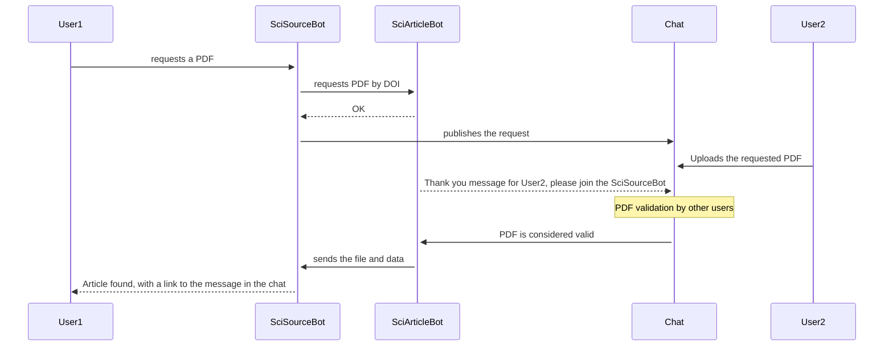
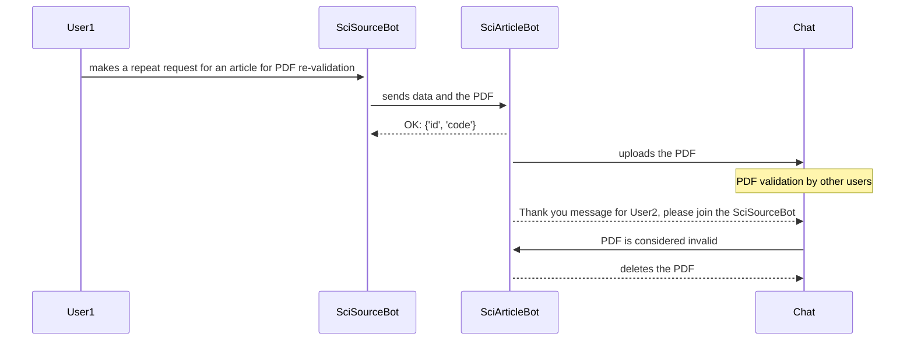

# Project Architecture
The `@SciArticleBot` bot interacts with another service—the `@SciSourceBot` bot—via secure HTTP requests, and with users in the `SciArticle Search` chat.

## `SciArticleBot` Project Models:

- **`ChatUser`**
  > Represents a Telegram user or bot. Contains profile data and the `is_bot` flag.

- **`Request`**
  > An article request by DOI. Used to track the processing status of the request.

- **`PDFUpload`**
  > Stores information about an uploaded PDF file linked to a specific `Request`.

- **`Validation`**
  > Stores a user's vote on a PDF's validity (valid/invalid). One vote per file.

- **`Notification`**
  > Notifications sent to users (for uploading or validating).

- **`Subscription`**
  > A subscription granted to a user for their activity (uploading or validating PDFs).

- **`Config`**
  > Global configuration for subscription thresholds. There can be only one entry.

- **`Count`**
  > User activity counters: number of uploads, validations, subscriptions, and deletions.

All models are linked to Telegram users through `ChatUser`.
PDF files are stored at the path specified in the `PDFUpload.path` field.

The `Count` model is designed to track each user's activity: the number of requests, uploads, PDF validations, deleted files, and subscriptions. User activity statistics in this model are maintained using `Django signals`. They automatically update activity counters when specific actions are performed:

| Signal                        | Description                                          |
|-------------------------------|------------------------------------------------------|
| `on_pdfupload_created`        | Increases `upload_count`, `total_upload_count`       |
| `on_validation_created`       | Increases `validation_count`, `total_validation_count`|
| `on_request_created`          | Increases `request_count`                            |
| `on_pdfupload_deleted`        | Increases `deleted_pdf_count`                        |

The `upload_count` and `validation_count` counters are adjusted when a subscription is granted.

The logic for updating subscription counters is handled in the `check_and_award_subscription` function.

## Core Functions:
 - Sending/receiving data and PDF files between bots via REST API
 - Accepting and uploading PDF files from Telegram users in the public `SciArticle Search` chat
 - Extracting the DOI from the name of the uploaded file
 - Saving/storing/updating information in the database
 - Deleting information from the database
 - Organizing the process of PDF verification and re-verification in the public `SciArticle Search` chat
 - Notifying users in the public `SciArticle Search` chat about the results of their uploads or validations
- Logic for awarding subscriptions to users for uploading or validating PDF files
- Deleting expired messages from the public `SciArticle Search` chat, such as PDF requests, PDF files, and user notifications about their upload/validation results

## Background Tasks (Celery Beat)

The scheduler periodically runs tasks to keep the system up-to-date. These tasks are responsible for deleting expired messages from the public `SciArticle Search` chat.

| Task                                       | Schedule           | Description                                                                                                                                                                                                                                                               |
| ------------------------------------------ | ------------------ | ------------------------------------------------------------------------------------------------------------------------------------------------------------------------------------------------------------------------------------------------------------------------- |
| `bot.tasks.run_check`                      | Every hour         | Finds expired requests (older than 47 hours) in the database, changes their status to `expired`, and notifies the main service via an [HTTP request](api_reference.md#1).                                                                                                      |
| `bot.tasks.run_check_and_delete_pdf`       | Every hour         | Deletes messages with PDF files from the public `SciArticle Search` chat that were uploaded or validated more than 47 hours ago.                                                                                                                                            |
| `bot.tasks.run_check_and_delete_thank_message` | Every 20 minutes   | Finds all thank-you messages in the database that have expired. Checks if the user is a member of the `@SciSourceBot` bot via an [HTTP request](api_reference.md#3). If not, it resets their counters in the database and deletes the thank-you messages sent to the user in the public chat (lifespan - 1 hour). If they are a member, it sends an [HTTP request](api_reference.md#6) to `@SciSourceBot`. |

## Key Workflows:

1. Receiving an Article Request
The `@SciArticleBot` receives an HTTP request from `@SciSourceBot` and calls `request_pdf_task`, which:
- creates a `Request` if the request is new;
- ignores repeat requests from the same user;
- saves the request if it is from a different user.

 

2. Processing a PDF File (`check_pdf_file`):
- deletes the message if there is no active request;
- saves a `PDFUpload` if a request exists;
- sends an [HTTP request](api_reference.md#1) to the `@SciSourceBot` bot;
- calls `send_verification_message` and `send_thank_message`.

 

3. Handling a Vote (`handle_vote_callback_task`):
- checks if the user is allowed to vote;
- creates a `Validation`;
- with 2 votes—it updates `PDFUpload` if the PDF is valid ([HTTP request](api_reference.md#5)) or deletes it from the `SciArticle Search` public chat if it is invalid;
- calls `send_thank_message`, `send_pdf`, `delete_message_and_file`, or `new_send_request`.

 

4. Thank-You Messages (`send_thank_message`):
- checks if the user is subscribed to the `@SciSourceBot` bot via an [HTTP request](api_reference.md#3);
- if not subscribed, sends a message to the chat;
- if subscribed, sends an [HTTP request](api_reference.md#4);
- saves a `Notification`.

 

5. Verifying a PDF marked as "broken PDF":
- upon receiving a request from `@SciSourceBot`, it calls `request_pdf_task`, `validate_broken_pdf`;
- saves the file;
- creates a `PDFUpload`;
- publishes the file to the public chat on behalf of the `@SciSourceBot` bot;
- calls `send_verification_message`.

 

6. Deleting a PDF file (`delete_message_and_file`):
- deletes the message and file from the public `SciArticle Search` chat;
- updates `PDFUpload.state` to 'deleted'.

 

7. Repeat Request (`new_send_request`):
- searches for an active `Request` by DOI;
- sends an [HTTP request](api_reference.md#2) to the `@SciSourceBot` bot.

 

8. Granting a Subscription (`check_and_award_subscription`):
- checks the counters (`Count`);
- if the threshold (`Config`) is reached, it sends an [HTTP request](api_reference.md#7) to the `@SciSourceBot` bot and grants a subscription (`Subscription`).

 ## **DOI Article Request Diagram**

## **Diagram of a Repeat Article Request and PDF Re-validation**

