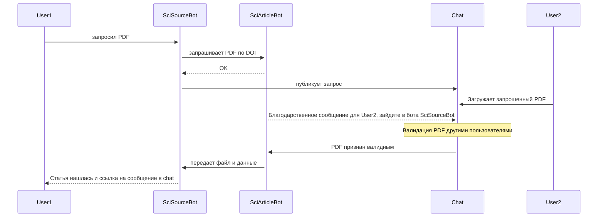
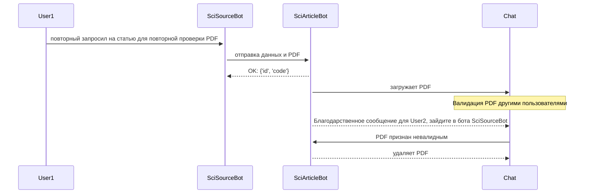

# Архитектура проекта
Бот `@SciArticleBot` взаимодействует с другим сервисом — ботом `@SciSourceBot` посредством защищённых HTTP-запросов и с пользователями в чате `SciArticle Search`. 

## Модели проекта `SciArticleBot`:

- **`ChatUser`**
  > Представляет Telegram-пользователя или бота. Содержит данные профиля и флаг `is_bot`.

- **`Request`**
  > Запрос на статью по DOI. Используется для отслеживания статуса обработки запроса.

- **`PDFUpload`**
  > Хранит информацию о загруженном PDF-файле, связанного с определённым `Request`.

- **`Validation`**
  > Хранит голос пользователя за валидность PDF (валиден/невалиден). Один голос на файл.

- **`Notification`**
  > Уведомления, отправляемые пользователям (за загрузку или проверку).

- **`Subscription`**
  > Подписка, выданная пользователю за активность (загрузки или проверки PDF).

- **`Config`**
  > Глобальная конфигурация порогов для подписки. Может быть только одна запись.

- **`Count`**
  > Счётчики активности пользователя: количество загрузок, проверок, подписок и удалений.

Все модели связаны с пользователями Telegram через `ChatUser`.  
PDF-файлы хранятся по адресу, указонному в поле `PDFUpload.path`.

Модель `Count` предназначена для отслеживания активности каждого пользователя: количество запросов, загрузок, проверок PDF, удалённых файлов и подписок. Вести статистику активновности пользователей в этой модели позволяют `Django signals`. Они автоматически обновляют счетчики активности при выполнении определённых действий:

| Сигнал                         | Описание                                         |
|-------------------------------|--------------------------------------------------|
| `on_pdfupload_created`        | Увеличивает `upload_count`, `total_upload_count`|
| `on_validation_created`       | Увеличивает `validation_count`, `total_validation_count`|
| `on_request_created`          | Увеличивает `request_count`                     |
| `on_pdfupload_deleted`        | Увеличивает `deleted_pdf_count`                 |

Счетчики `upload_count` и `validation_count` изменяются в зависимости от выдачи подписки.

Логика обновления счетчиков подписки происходит в функции `check_and_award_subscription`.

## Основные функции:
 - Получение/отправка данных и PDF-файлов между ботами через REST API
 - Прием и загрузка PDF-файлов от пользователей Telegram в общем чате `SciArticle Search` 
 - Извлечение DOI из названия загруженного файла
 - Сохранение/хранение/обновление информации в базе данных
 - Удаление информации из базы данных
 - Организаця процесса проверки и повторной проверки PDF-файлов в общем чате `SciArticle Search`
 - Уведомление пользователей в общем чате `SciArticle Search` о их результатах загрузки или валидации
- Логика начисления подписки пользователям за загрузку или проверку PDF-файлов
- Удаление из общего чата `SciArticle Search` просроченных сообщений: о запросах на pdf, pdf-файлов, уведомлений пользователей о их результатах загрузки или валидации

## Фоновые задачи (Celery Beat)

Планировщик запускает периодически задачи для поддержания системы в актуальном состоянии. Эти задачи отвечают за удаление из общего чата `SciArticle Search` просроченных сообщений.

| Задача                                     | Расписание выполнения        | Описание                                                                                                   |
| ------------------------------------------ | ------------------ | ---------------------------------------------------------------------------------------------------------- |
| `bot.tasks.run_check`                      | Каждый час        | Находит истекшие запросы (старше 47 часов) в базе данных, меняет их статус на `expired` и уведомляет основной сервис [http-запрос](api_reference_ru.md#1).       |
| `bot.tasks.run_check_and_delete_pdf`       | Каждый час        | Удаляет сообщения с PDF-файлами из общего чата `SciArticle Search`, которые были загружены или провалидированы более 47 часов назад.          |
| `bot.tasks.run_check_and_delete_thank_message` | Каждые 20 минут    | Находит все благодарственные сообщения в базе данных, у которых истек срок годности. Проверяет состоит ли пользователь в боте `@SciSourceBot` [http-запрос](api_reference_ru.md#3). Если не состоит, то обнуляет его счетчики в базе данных и удаляет благодарственные сообщения, отправленные пользователю в общий чат (срок жизни - 1 час). Если состоит, то отправляет [http-запрос](api_reference_ru.md#6) боту `@SciSourceBot`      |

## Основные ключивые моменты:

1. Получение запроса на статью
Бот `@SciArticleBot` получает http-запрос от `@SciSourceBot` и вызывает `request_pdf_task`, которая:
- создаёт `Request`, если запрос новый;
- игнорирует повторные запросы от того же пользователя;
- сохраняет запрос, если он от другого пользователя.

 

2. Обработка PDF-файла `check_pdf_file`:
- удаляет сообщение, если нет активного запроса;
- сохраняет `PDFUpload` при наличии запроса;
- отправляет [http-запрос](api_reference_ru.md#1) в бот `@SciSourceBot`;
- вызывает `send_verification_message` и `send_thank_message`.

 

3. Голосование `handle_vote_callback_task`:
- проверяет, может ли пользователь голосовать;
- создаёт `Validation`;
- при 2 голосах — обновляет `PDFUpload`, если валидный PDF [http-запрос](api_reference_ru.md#5) или невалидный - удаляет из общего чата `SciArticle Search`;
- вызывает `send_thank_message`, `send_pdf`, `delete_message_and_file` или `new_send_request`.

 

4. Благодарственные сообщения `send_thank_message`:
- проверяет подписан ли пользователь на бота `@SciSourceBot` [http-запрос](api_reference_ru.md#3);
- если не подписан — отправляет сообщение в чат;
- если состоит — [http-запрос](api_reference_ru.md#4); 
- сохранение Notification.

 

5. Проверка PDF-файла, помеченного как «сломанный PDF»:
- при получении запроса от `@SciSourceBot` вызывает `request_pdf_task`, `validate_broken_pdf`;
- сохраняет файл;
- создаёт `PDFUpload`;
- публикует файл в общий чат от имени бота `@SciSourceBot`;
- вызывает `send_verification_message`.

 

6. Удаление PDF-файла `delete_message_and_file`:
- удаляет сообщение и файл из общего чата `SciArticle Search`;
- обновляет `PDFUpload.state` на 'deleted'.

 

7. Повторный запрос `new_send_request`:
- ищет активный `Request` по DOI;
- отправляет [http-запрос](api_reference_ru.md#2) в бот `@SciSourceBot`.

 

8. Выдача подписки `check_and_award_subscription`:
- проверяет счётчики (`Count`);
- если достигнут порог (`Config`) — [http-запрос](api_reference_ru.md#7) боту @SciSourceBot и выдача подписки (`Subscription`).

 ## **Диаграмма запроса на статью по DOI**

## **Диаграмма повторного запроса на статью по DOI и повторной проверки PDF-файла**

